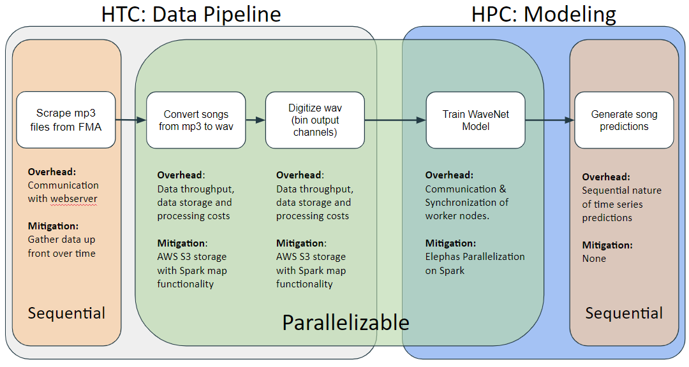

Looking at the end-to-end workflow of our application, we see that our parallelism falls within both HTC, for data processing such as converting songs from mp3 to wav files - and digitizing these wav files - as well as HPC for training our generative model. The two ends of the application workflow, initial scraping of mp3 files from Free Music Archive online and song generation from the trained model, remain sequential.
 
Though there are a few overheads involved throughout the process, we are able to mitigate them through pipeline design and model choices. 

To address communication limits with the FMA webserver, we have begun gradually scraping data over time; and to combat throughput issues we will use AWS storage and spark parallelization.

In the model training step, elephas will enable us to train the wavenet model on spark across a cluster of workers. We will mitigate issues of communication and synchronization of the worker nodes by having a master model which sends parameters to workers to train, and then receives them back with write-locks to iteratively update the master parameters of the final model.

However, because of the nature of model, though we are able to train using continuous windows of existing songs, we’ll be unable to reasonably parallelize generation, since we require sequential predictions to be inputs for the next prediction.
